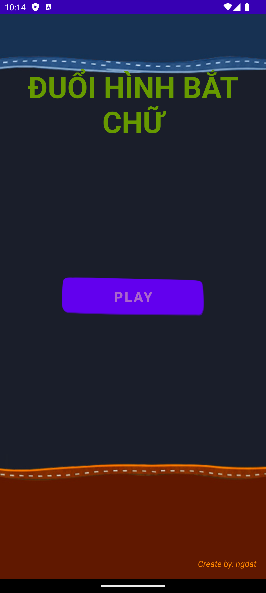
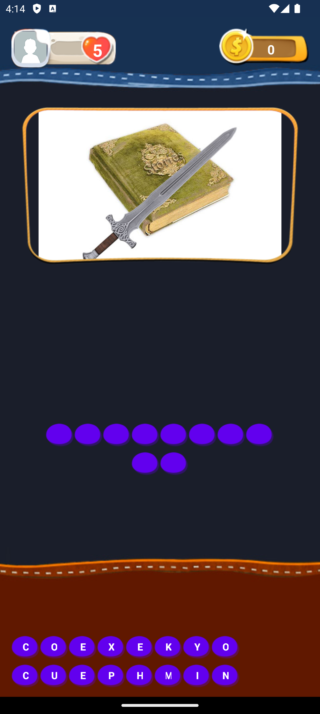
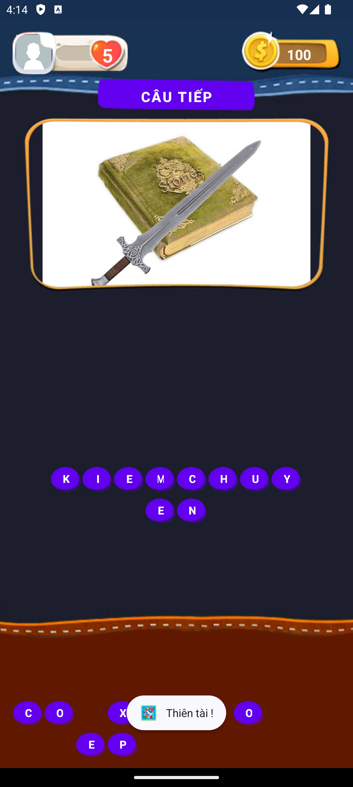

## 💝 Ủng hộ tôi

### Nếu bạn thấy dự án của tôi hữu ích và muốn ủng hộ tôi, hãy quét mã QR bên dưới:

|                                                                              |  |  |  |
|-------------------------------------------------------------------------------------------------------------------------------|-----------------------------------|---------------------------------------------------|-----------------------------------|
| **Momo:&nbsp;&nbsp;&nbsp;&nbsp;&nbsp;&nbsp;&nbsp;&nbsp;&nbsp;&nbsp;&nbsp;&nbsp;&nbsp;&nbsp; 0981054498 - NGUYEN ANH DAT** | **Thank you 🙌**                  | **Techcombank: 1981054498 - NGUYEN ANH DAT**  | **Thank you 🙌**                  |

### Cảm ơn sự hào phóng của bạn! 🙌

---

## Giới thiệu ứng dụng DuoiHinhBatChu

### Mô tả

- Ứng dụng **DuoiHinhBatChu** có ngôn ngữ lập trình là `Android - Java`. Tôi code cơ bản và dễ hiểu, phù hợp với ai mới học. Tôi cũng đã cập nhật, bạn chỉ cần tải về và chạy.
- Ứng dụng **DuoiHinhBatChu** có các tính năng cơ bản của trò chơi Đuổi hình bắt chữ.

#### Màn hình

|  |  |  |  | 
|----------------------------------|----------------------------------|----------------------------------|----------------------------------|

